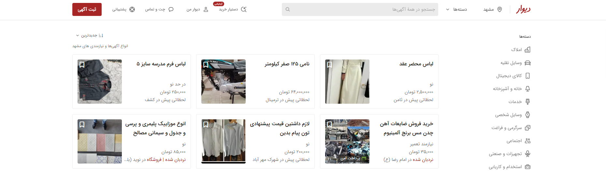
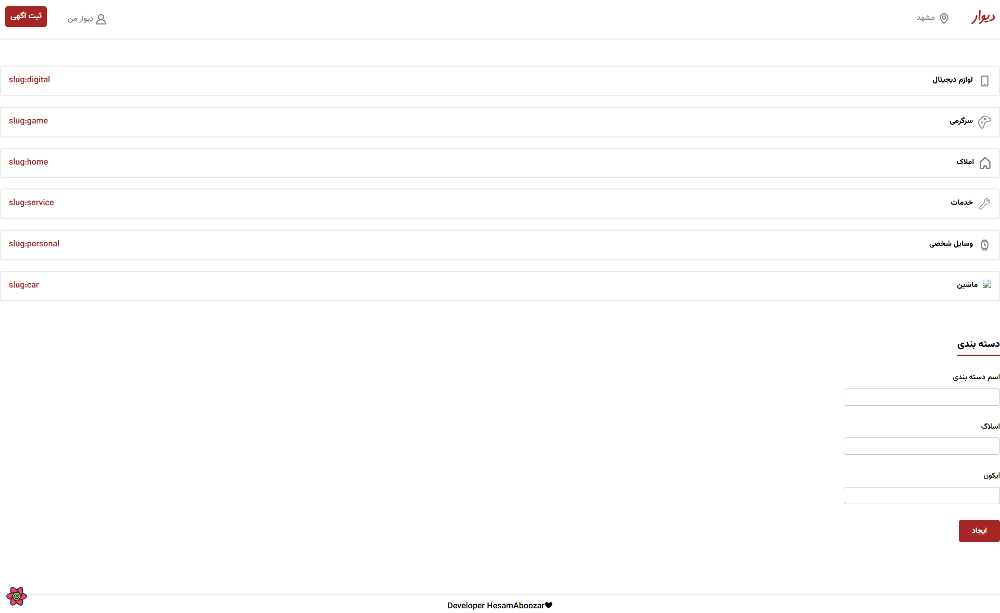
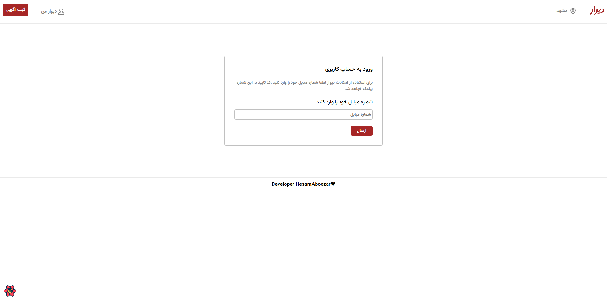

# 🏠 پروژه دیواره (Divaare)

<p align="center">
  
</p>

## 📌 معرفی پروژه
این سایت شبیه سازی دقیق سایت دیوار است با تمام امکانات و مشخص شدن سطح دسترسی ها 
---

## 🚀 تکنولوژی‌های استفاده‌شده
- ⚛️ React
- 🌐 Axios
- 🗄️ [Backend API](#) (لینک یا توضیح)


---

## ✨ ویژگی‌ها
- ثبت آگهی همراه با عکس
- جستجوی پیشرفته بر اساس دسته‌بندی
- فیلتر نتایج بر اساس قیمت و موقعیت
- احراز هویت کاربران
- رابط کاربری واکنش‌گرا (Responsive)
-ورود به عنوان ادمین با شماره مجزا

---

## 📷 تصاویر پروژه
<p align="center">
  
  صفحه ادمین 
</p>

<p align="center">
  
</p>

---

## 📥 نصب و راه‌اندازی

```bash
# کلون کردن پروژه


# نصب وابستگی‌ها
npm install

# اجرای پروژه
npm run dev

نصب فایل بک اند به شمارم پیام بدید **


///////////////////////////////////////////////////////////////////
En

## 📌 Project Introduction
This site is an exact simulation of the Divar site with all the features and specified access levels 
---

## 🚀 Technologies used
- ⚛️ React
- 🌐 Axios
- 🗄️ [Backend API](#) (Link or description)]

---

## ✨ Features
- Post an ad with a photo
- Advanced search by category
- Filter results by price and location
- User authentication
- Responsive user interface
- Login as an admin with a separate number

---
## 📥 Installation and Setup


# Install dependencies

npm install

# Run the project
npm run dev

Install the backend file Message me **